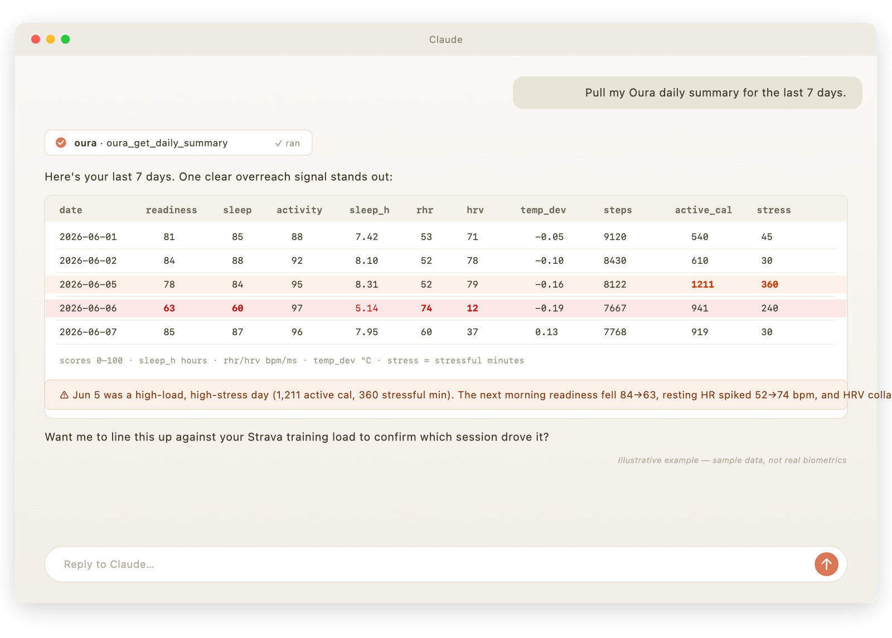

# Oura MCP server

A Model Context Protocol (MCP) server that gives Claude **read-only** access to your
[Oura ring](https://ouraring.com) biometrics via the [Oura API v2](https://cloud.ouraring.com/v2/docs).

It's designed to sit **alongside a Strava connector**: every tool is namespaced `oura_*` and
keyed by ISO date (`YYYY-MM-DD`), so Claude can join Oura recovery data against Strava training
load on `date` and answer questions like *"how did last week's hard sessions affect my sleep,
stress, and next-day readiness?"* in one reasoning step.



<sub>Illustrative example using sample data, not real biometrics.</sub>

## Tools

| Tool | What it returns | Default window |
|------|-----------------|----------------|
| `oura_get_daily_summary` | **Start here.** One row/day: readiness, sleep & activity scores, total sleep, resting HR, HRV, temp deviation, steps, active calories, daytime stress. The cross-source join table. | 30 days |
| `oura_get_sleep_detail` | Per-night architecture: bedtime, sleep stages (deep/REM/light), efficiency, latency, avg/lowest HR, HRV, respiratory rate. | 14 days |
| `oura_get_readiness_detail` | Readiness with every contributor (hrv_balance, resting HR, recovery index, body temp, previous-day activity, sleep balance…) — explains *why* readiness moved. | 30 days |
| `oura_get_stress_resilience` | Daytime stress vs. recovery minutes, day summary, and long-term resilience level + contributors. | 30 days |
| `oura_get_workouts` | Workouts as logged by Oura — reconcile against Strava, catch missed sessions, see intensity labels. | 30 days |
| `oura_get_baselines` | Slow-moving baselines: overnight SpO2, breathing disturbance, cardiovascular/vascular age, VO2 max. | 90 days |
| `oura_get_heart_rate` | Fine-grained HR timeseries, tagged by source (awake/rest/sleep/workout). Aggregated stats by default. | 24 hours |

All output is compact CSV with units stated in the column names.

## Setup

```bash
python -m venv .venv && source .venv/bin/activate   # Windows: .venv\Scripts\activate
pip install -e .
```

> **New here?** The [full setup & configuration guide](docs/SETUP.md) walks through install,
> token creation, the Claude Desktop config, common mistakes, and troubleshooting.

## Authentication

This server uses an Oura **Personal Access Token** (PAT):

1. Go to <https://cloud.ouraring.com/personal-access-tokens> and create a token.
2. Copy `.env.example` to `.env` and paste the token into `OURA_PERSONAL_ACCESS_TOKEN`
   (for local dev), or set it in the Claude Desktop `env` block below.

Never commit your real token — `.env` is gitignored.

## Run / test

```bash
fastmcp dev server.py     # opens the MCP Inspector to exercise each tool manually
```

## Install in Claude Desktop

Edit `claude_desktop_config.json` (macOS: `~/Library/Application Support/Claude/`,
Windows: `%APPDATA%\Claude\`) and add:

```json
{
  "mcpServers": {
    "oura": {
      "command": "/Users/ericcarr/Documents/GitHub/oura-mcp-server/.venv/bin/python",
      "args": ["/Users/ericcarr/Documents/GitHub/oura-mcp-server/server.py"],
      "env": {
        "OURA_PERSONAL_ACCESS_TOKEN": "your-token-here"
      }
    }
  }
}
```

Use the venv's Python interpreter and an absolute path to `server.py`. Fully quit and reopen
Claude Desktop after editing. The `oura_*` tools then appear in the tools/connectors menu,
ready to use alongside your Strava tools.

## Usage & examples

Once the server is connected, just ask Claude in plain language — it picks the right tool(s) and
date ranges. A few patterns that work well:

### Oura on its own

- *"Pull my Oura daily summary for the last two weeks."*
- *"Did my readiness drop after any night this month? Show me why."* → `oura_get_readiness_detail`
- *"Break down last night's sleep stages and compare them to my 14-day average."* → `oura_get_sleep_detail`
- *"Which days this month were most stressful, and how's my resilience trending?"* → `oura_get_stress_resilience`
- *"How's my VO2 max and SpO2 trending over the last 90 days?"* → `oura_get_baselines`
- *"What was my heart rate during yesterday's workout vs. overnight?"* → `oura_get_heart_rate`

### The headline use case — Oura + Strava together

Because both connectors are date-keyed, Claude can join them on `date` in one step:

- *"Compare last month's Strava training load against my Oura readiness and sleep. Flag any days
  I overreached (readiness or HRV dropped the morning after a hard session)."*
- *"After my long runs, how much does my resting heart rate rise the next morning, and how long
  until it recovers to baseline?"*
- *"Do my hardest training days hurt that night's deep sleep? Show the correlation."*
- *"Reconcile my Strava activities with Oura's logged workouts for the past month — did Oura catch
  anything Strava missed?"* → `oura_get_workouts`
- *"Build me a weekly table: Strava distance & suffer score next to Oura sleep score, avg HRV, and
  next-day readiness, so I can see if my training plan is sustainable."*

### What the data looks like

Tools return compact CSV with units in the column names — easy for Claude to reason over and join.
For example, `oura_get_daily_summary` returns rows like:

```csv
date,readiness_score,sleep_score,activity_score,total_sleep_h,resting_hr_bpm,avg_hrv_ms,temp_deviation_c,steps,active_cal,stress_high_min,day_summary
2026-06-05,78,84,95,8.31,52,79,-0.16,8122,1211,360,stressful
2026-06-06,63,60,97,5.14,74,12,-0.19,7667,941,240,stressful
2026-06-07,85,87,96,7.95,60,37,0.13,7768,919,30,normal
```

Here the high-load, high-stress day (Jun 5: 1,211 active cal, 360 stressful min) is followed by a
readiness crash (84→63), a resting-HR spike (52→74 bpm), and an HRV collapse (79→12 ms) — exactly
the training-to-recovery signal this server is built to surface.

> **Tip:** start broad with `oura_get_daily_summary`, then drill into a specific day or signal with
> the detail tools (`oura_get_readiness_detail`, `oura_get_sleep_detail`). Keep date ranges modest
> to stay fast and within Oura's rate limit.

## Notes & limits

- **Read-only.** No tool writes to your Oura account.
- Dates are ISO `YYYY-MM-DD` and the range is inclusive. Heart rate uses ISO 8601 datetimes.
- Some metrics are sparse or ring/firmware-dependent (VO2 max, cardiovascular age, resilience
  need enough history); rows show blanks where a metric wasn't measured.
- Oura's rate limit is ~5000 requests/day; tools default to modest windows and paginate
  automatically.
